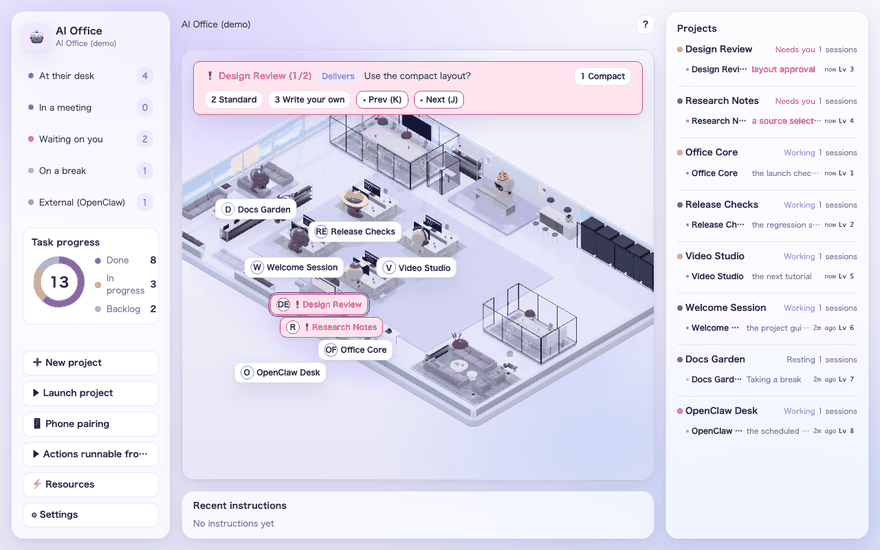

# 🏢 AI Office — AIエージェント艦隊の管制室

**Macで動く全 Claude Code セッションを、3Dアイソメのロボットオフィスとしてライブ表示し、そのまま操作する。**

**1セッション＝1体のロボット**。Claude Code で `/rename` した名前がそのままアバターの名前になるので、同じフォルダで3つ4つ並走していても誰が誰か分かる（プロジェクト単位にまとめる旧モードも設定で選べる）。誰が作業中で、誰がサブエージェントと会議中で、誰があなたの返事待ちで止まっているかがフロア1枚で分かる。見るだけでなく**動かせる**のが核: ❗トレイの数字キーで即回答・ロボットをクリックして状況シートから指示・**ターミナルに出た許可の確認にもこの画面から答えられる**。



> セッションが無くても <http://localhost:4780/?demo=1> ですぐ見られます。

## なぜ作ったか

エージェントを並列で走らせると、ボトルネックはAIではなく**人間側**になる。席を離れた瞬間に、承認プロンプトと質問でセッションが止まる。

AI Office はそのループを閉じる:

- ❗ 承認・質問が発生するとロボットの頭上にビックリマーク＋iPhoneへ**プッシュ通知**
- 質問の**実際の選択肢がそのままボタン**になる（`AskUserQuestion` をミラー）— 1キー/1タップで回答
- 返答は Stop-hook 経由で**実セッションの中に届き、エージェントは走り続ける**

## 主な機能

- **🤖 ライブ3Dオフィス** — 1アバター=1セッション（`/rename` の名前で表示）・タイピング/伸び/コーヒー/会議のロボット挙動
- **⌨️ 許可・質問への回答** — ターミナルで止まっている承認プロンプトに、この画面から答えて動かす（下記）
- **❗ 回答キュー** — 最優先の質問がトレイに常駐、数字キーで即答
- **📇 状況シート** — 生ログでなく「人間が読む1文」＋いま/次/完了タスク＋クイック返信チップ＋自由入力
- **👑 ボスデスク** — 金の王冠ロボをクリック→任意のプロジェクトへ指令
- **🔔 デスクトップ通知＋18時の日報** / **🎬 デモモード**（`/?demo=1`）
- **📱 スマホPWA＋Web Push** / **💸 コストゲージ**（Claude/Codex/各プロバイダの枠と月額）
- **🔌 MCPツール** — `office_status` / `office_instruct`（エージェント自身がオフィスを読み書きできる）
- **🔒 プライバシー設計** — 127.0.0.1のみ・transcripts読み取り専用・**本文はMac側で除去してから中継**
- **依存ゼロ** — サーバーはPython標準ライブラリのみ。クローンして即動く

## クイックスタート（1コマンド）

```bash
git clone https://github.com/senao-routine/ai-office.git && cd ai-office
bash setup.sh
```

`setup.sh` が **指示配達の配線 → 常駐登録（launchctl まで実行）→ 起動確認 → 画面を開く** まで
最後まで通します（手動の launchctl 手打ちは不要）。動作確認だけしたいときは `bash setup.sh --no-daemon`、
状態診断は `bash setup.sh --check`。

MCP登録（任意）:

```bash
claude mcp add --scope user aioffice -- "$(command -v python3)" "$PWD/server/mcp_office.py"
claude mcp list   # → aioffice: connected
```

## 配達経路（仕組み）

1. UI/PWA/MCP から投函 → `~/.claude/office_inbox/<セッションID>.json`
2. グローバル Stop hook（`office-inbox-wait.sh`・asyncRewake）がポストを監視し、**そのセッションを起こして指示を渡す**
3. 届くタイミング: 待機中=数秒／作業中=ターン終了直後／閉じたセッション=次に開いた後。📨=配達待ち

「今やっていること」はトランスクリプト末尾（読み取り専用・直近のみ）からの推定。

### 許可・質問への回答（`PermissionRequest` フック）

指示ポストはターンの終わりにしか届かないので、**権限ダイアログや質問で止まったセッション**には
構造的に届かない。そこで第2の口として `PermissionRequest` フックを置く（`setup.sh` が配線）。

1. 質問／許可要求が出ると、フックが「いま何を聞かれているか」を掲示する
2. オフィスの❗がその掲示を一次情報として表示する（推測ではなく事実）
3. 画面から答えると、フックがその回答を決定として返す＝**止まっていたセッションが動き出す**

- **Macの画面（127.0.0.1）からは「✅ 許可する」も出せる**（＝ターミナルで許可するのと同じ）
- **スマホからは言葉を届けるだけ**（実行の許可は渡せない）。中継トークンが漏れても、
  それだけで任意のコマンドが実行されることは無い、という線をここで引いている
- **ターミナルの挙動は変わらない**: 回答しなければ、いつもどおりの許可ダイアログが出て、
  人がその場で答えられる（フックが待っている間でも人の回答が優先される）

## スマホ連携（任意）

中継は**自分の Cloudflare アカウント**で動く（無料枠で十分・ポート開放なし・Macは完全アウトバウンド）。

```bash
bash relay/setup.sh   # ログイン確認 → トークン/通知鍵(VAPID)を自動生成 → デプロイ → 設定書込 → 疎通確認
```

そのあと: オフィスUI → 📱 → デバイス発行 → QRペアリング → iPhoneでホーム画面に追加（iOS 16.4+）→ 🔔 でPush有効化。
（VAPIDを設定しないと🔔を押しても通知が来ません。`relay/setup.sh` はここまで自動でやります。）

中継は輸送トークンしか持たず**指示を偽造できない**（真正性は per-device HMAC 署名を Mac 側で検証する二層認証）。

## 料金

**全機能無料。** ローカルオフィスも、スマホPWA・プッシュ通知・遠隔実行・コストダッシュボードも
すべて含まれます。ライセンス無し・サブスク無し・アカウント無し・テレメトリ無し。

更新情報とメンバーコミュニティ（新作の先行配布・伴走サポート）は
[特設ページ](https://routinelabo-lp.routinelabo-senao.workers.dev)から。

### `setup.sh` が触るもの

- `~/.claude/settings.json` — フックを2本追加（バックアップを残します）。
  **Stop** フック＝ターンの終わりに指示を届ける経路、**PermissionRequest** フック＝
  止まっている許可・質問に答える経路。どちらも**ターミナルの動作は変えません**
  （オフィスから答えなければ、いつもの確認が出て、その場で答えられます）。
- `~/Library/Application Support/AIOffice/` — 本体とデータ
- `~/Library/LaunchAgents/com.senao.aioffice.plist` — ログイン時の自動起動
- 初回にオフィスがターミナルを開くとき、macOS が**自動化の許可**を1度だけ聞きます

## やめるとき（アンインストール）

```bash
bash macapp/uninstall.sh              # 常駐とコードを削除（設定 data/ は残す）
bash macapp/uninstall.sh --purge-data # 設定ごと全部消す
```

`~/.claude/settings.json` に足したフック2本（`office-inbox-wait` / `office-approval-wait`）は
自動では消しません。不要なら該当ブロックを手で削るか、バックアップ
（`settings.json.bak-…`）へ戻してください。フックが残っていても、オフィスを止めた状態では
**待機してタイムアウトするだけ**でターミナルの動作は変わりません。

## 動作環境

- macOS（Apple Silicon / Intel）・Python 3.9+（システムの `python3` でOK）
- [Claude Code](https://claude.com/claude-code)
- UI言語: 日本語/英語（ロケール自動判定・`office_config.json` の `"lang"` で固定可。常駐インストール時の編集先は `~/Library/Application Support/AIOffice/data/office_config.json`）

## 開発者向け

検証ループは `bash verify.sh`（全ゲート）と `bash dev.sh`（fixture高速レーン）。中継の設計は `relay/README.md`。

---

Built by [senao](https://github.com/senao-routine) / Routine Labo.
